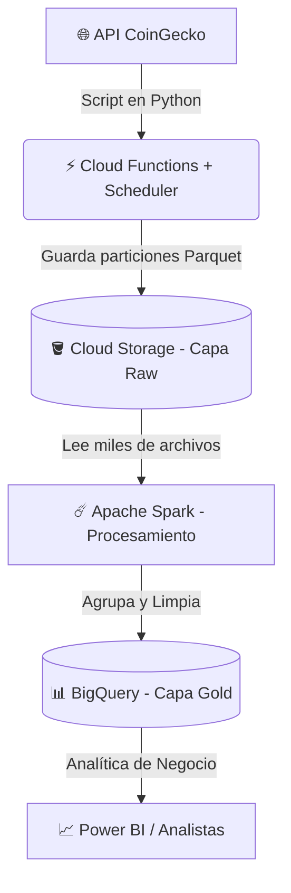

# 🪙 Crypto Big Data Pipeline: Serverless & Apache Spark

Este proyecto es un pipeline de datos End-to-End diseñado para extraer, almacenar, procesar y disponibilizar datos financieros (Criptomonedas) utilizando una arquitectura moderna en la nube. 

El principal objetivo técnico de este proyecto es demostrar la automatización mediante infraestructura Serverless y la resolución del **"Small File Problem"** utilizando procesamiento distribuido con Apache Spark.

## 🏗️ Arquitectura del Proyecto


⚙️ Flujo de Datos (Paso a Paso)

Extracción (Ingesta): Un script modular en Python consume la API pública de CoinGecko para obtener el precio y volumen del Bitcoin, Ethereum y Solana en tiempo real.
Orquestación Autónoma: El código está desplegado en Google Cloud Functions y orquestado mediante Cloud Scheduler para ejecutarse automáticamente cada hora, las 24 horas del día (Micro-batching).
Data Lake (Capa Bronce): Los datos en bruto aterrizan en un bucket de Google Cloud Storage en formato columnar óptimo (.parquet), particionados automáticamente por fecha y hora.
Procesamiento Distribuido: Para procesar el historial acumulado y evitar cuellos de botella por múltiples archivos pequeños, se utiliza Apache Spark (PySpark), agrupando la información y calculando promedios y máximos históricos.
Data Warehouse (Capa Oro): El DataFrame final procesado se inyecta directamente en Google BigQuery, listo para ser consumido por analistas de negocio en herramientas de BI.

🛠️ Stack Tecnológico

Lenguaje: Python 3.11 (Pandas, PyArrow, Requests)
Big Data Engine: Apache Spark (PySpark)
Cloud Provider (GCP):
Compute: Cloud Functions, Cloud Scheduler
Storage: Cloud Storage (GCS)
Data Warehouse: BigQuery
Entorno de Procesamiento: Google Colab / Databricks

📸 Evidencia de Ejecución en la Nube

Para validar la correcta ejecución y automatización del pipeline, aquí presento la evidencia de los datos aterrizando en las distintas capas de Google Cloud Platform:
1. Data Lake (Google Cloud Storage)
   
    Aquí se observa cómo el Cloud Scheduler ejecuta la función Serverless cada hora, depositando los archivos Parquet de forma automatizada.
    
    
3. Data Warehouse (Google BigQuery)

    Aquí se evidencia el resultado final tras el procesamiento distribuido con Apache Spark. Los datos limpios, agregados y transformados aterrizan en la tabla analítica final.
    

🚀 Cómo replicar este proyecto

Si deseas ejecutar la etapa de ingesta localmente antes de desplegarla en Cloud Functions:
1. Clona este repositorio:
   ```bash
   git clone https://github.com/Hanser193/crypto-data-pipeline.git
   cd crypto-data-pipeline
    ```
3. Instala las dependencias:
    ```bash
    pip install -r requirements.txt
    ```b
5. Ejecuta el pipeline principal:
    ```bash
    python main.py
    ```
Desarrollado por Brayan Smith Hanser - Data Engineer
