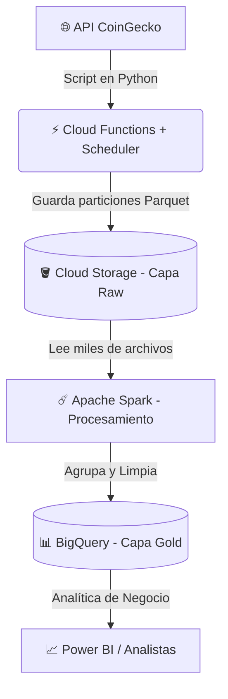

# 🪙 Crypto Big Data Pipeline: Serverless & Apache Spark

Este proyecto es un pipeline de datos End-to-End diseñado para extraer, almacenar, procesar y disponibilizar datos financieros (Criptomonedas) utilizando una arquitectura moderna en la nube. 

El principal objetivo técnico de este proyecto es demostrar la automatización mediante infraestructura Serverless y la resolución del **"Small File Problem"** utilizando procesamiento distribuido con Apache Spark.

## 🏗️ Arquitectura del Proyecto

## Bucket

## BigQuery

